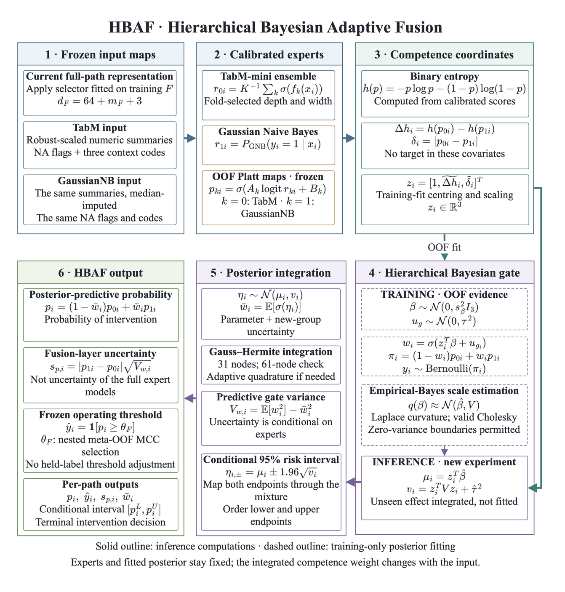
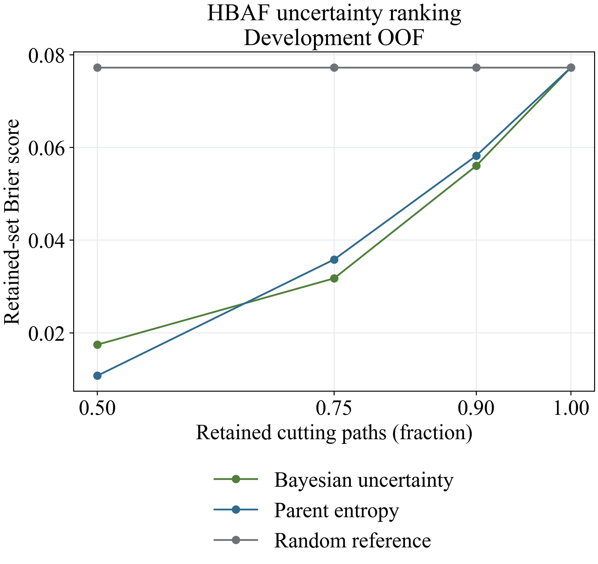

# HBAF: Bayesian Milling Monitoring

An executable research repository for **Hierarchical Bayesian Adaptive Fusion (HBAF)** in cutting-path intervention prediction. It combines calibrated tabular and probabilistic experts with an input-dependent hierarchical Bayesian fusion layer.

The repository includes six notebooks with recorded outputs, the required public MSM data subset, frozen out-of-fold predictions, compact result tables and the numbered figures used in the accompanying manuscript. It does not require a private model archive or a Kaggle account to inspect the included results.

**Evidence boundary.** The completed experiment shows favourable point estimates against the matched calibrated parent, but does **not** establish consistent superiority, joint predictive non-inferiority or a statistically confirmed Bayesian advantage after multiplicity correction. Negative controls and posterior-approximation limitations are retained. This is a research implementation, not a validated autonomous machine-control system.

## Task and data

The observation is an **annotated cutting path**, clustered within a machining experiment. `InterventionRequired = 1` combines `Abnormal` and `Tool defect`; `Normal` maps to 0. The original three-state label is retained for descriptive analysis.

| Domain / role | Machine | Paths | Experiments | Intervention paths |
|:--|:--|--:|--:|--:|
| Development training | `imi_vmx30ui` | 563 | 11 | 127 |
| Historical validation partition | `imi_vmx30ui` | 192 | 3 | 64 |
| Historical internal partition | `imi_vmx30ui` | 172 | 5 | 32 |
| Previously inspected cross-machine partition | `imi_vm20i` | 1,585 | 37 | 412 |

Current HBAF development uses the **563-path training corpus only**. The remaining partitions are not fresh sealed confirmation sets. No current-HBAF Internal/External performance is claimed in this release. `tmf_vf10` measurement folders are not included or used; the original summary workbook is retained unchanged as source metadata.

Source: ManuFutureToday, [Multi-Sensor and MTConnect Dataset of Metal Cutting Anomaly in Milling from Laboratory and Industry Settings](https://www.kaggle.com/datasets/manufuturetoday/multi-sensor-for-metal-milling-anomaly), [DOI: 10.34740/kaggle/ds/8392825](https://doi.org/10.34740/kaggle/ds/8392825). The source dataset is distributed under [Creative Commons Attribution 4.0 International](https://creativecommons.org/licenses/by/4.0/). The 115 bundled source files are an unmodified subset of the two used machine domains: MTC measurements, path annotations, XML metadata and the summary workbook. Repository selection, engineered representations and model outputs are downstream work, not additional source measurements. Preserve this attribution when redistributing the data; this statement does not assign a software licence to other repository content.

## HBAF implementation



1. Fit feature cleaning, mutual-information Top-64 ranking, imputation and family-specific transformations within the corresponding training boundary.
2. Fit TabM and Gaussian Naive Bayes experts; obtain cross-fitted probabilities and fit training-only Platt calibration maps.
3. Form gate covariates from the experts' entropy contrast and absolute disagreement.
4. Fit a Bernoulli mixture likelihood with Gaussian priors on gate coefficients and experiment random effects. Estimate prior scales by training-only empirical-Bayes Laplace evidence, including zero-variance boundaries.
5. Integrate the conditional gate posterior and an unseen experiment effect using checked quadrature. Select the operating threshold from nested meta-OOF predictions.

The resulting probability is `(1 − w(x)) p_TabM(x) + w(x) p_GNB(x)`, where the posterior-averaged weight depends on the input. This is **not** a manually fixed weighted average. The parameters remain fixed at inference: input-adaptive fusion is not online retraining or target-domain adaptation.

This completed HBAF is a terminal, full-path model. It does not implement a validated physical degradation-state hierarchy, a retained temporal branch, Student-t state emissions or source-free adaptation. Those proposed mechanisms must not be inferred from the project name. Its uncertainty is conditional on the fusion layer and fixed experts, not the full epistemic uncertainty of the complete model.

## Development results

All values below come directly from [the stored summary](artifacts/hbaf_current_summary.csv): five repeated seeds, three experiment-disjoint outer folds, 563 development paths. Metrics are calculated over the complete OOF paths for each repeat and then averaged over repeats. PR-AUC is implemented as **average precision**. Bold marks the best point estimate **within the displayed cohort**, not statistical significance; tied best values are retained.

### Matched HBAF and component controls

These eight models use the current nested meta-threshold protocol and provide the direct component comparisons.

| Model | MCC ↑ | PR-AUC ↑ | Macro-F1 ↑ | AUROC ↑ |
|:--|--:|--:|--:|--:|
| HBAF | 0.6383 | 0.8552 | 0.8126 | 0.9548 |
| TabM calibrated | 0.5437 | 0.8538 | 0.7643 | 0.9376 |
| GaussianNB calibrated | 0.5444 | 0.6764 | 0.7645 | 0.9232 |
| Global learned fusion | 0.5669 | 0.8399 | 0.7731 | 0.9433 |
| Equal fusion | 0.6175 | **0.8609** | 0.8013 | **0.9557** |
| MAP gate | 0.4931 | 0.8300 | 0.7372 | 0.9417 |
| No hierarchy | **0.6716** | 0.8252 | **0.8262** | 0.9452 |
| Raw TabM | 0.6091 | 0.8487 | 0.7986 | 0.9331 |

| Model | Brier ↓ | NLL ↓ | ECE ↓ |
|:--|--:|--:|--:|
| HBAF | 0.0773 | 0.2420 | 0.0585 |
| TabM calibrated | 0.0877 | 0.3389 | 0.0736 |
| GaussianNB calibrated | 0.0944 | 0.2947 | 0.0818 |
| Global learned fusion | 0.0788 | 0.2531 | 0.0551 |
| Equal fusion | **0.0737** | **0.2313** | **0.0500** |
| MAP gate | 0.0890 | 0.2970 | 0.0683 |
| No hierarchy | 0.0865 | 0.2776 | 0.0755 |
| Raw TabM | 0.1113 | 0.3639 | 0.1182 |

Relative to the matched calibrated TabM parent, HBAF changes mean MCC by **+0.0946**, Brier by **−0.0105**, and NLL by **−0.0969**. However, equal fusion has better PR-AUC and proper scores, while removing hierarchy yields higher MCC and Macro-F1. Thus adaptive Bayesian implementation alone is not evidence of a uniquely beneficial full architecture.

### All 18 competitive models

These retained Notebook 03 models use their original nested-threshold protocol. Their rows remain visible even when they outperform HBAF. In particular, TabM and GaussianNB have the same calibrated probability evidence as their matched counterparts above, but **different operating thresholds**. Threshold-dependent scores across the two cohorts are not a clean component-effect comparison.

| Model | MCC ↑ | PR-AUC ↑ | Macro-F1 ↑ | AUROC ↑ |
|:--|--:|--:|--:|--:|
| Dummy — Empirical Prior | 0.0000 | 0.1978 | 0.4364 | 0.4114 |
| Elastic-Net Logistic Regression | 0.5490 | 0.7311 | 0.7704 | 0.8872 |
| Random Forest | 0.3546 | 0.3773 | 0.6050 | 0.7449 |
| Extra Trees | 0.4481 | 0.5346 | 0.6839 | 0.8085 |
| HistGradientBoosting | 0.3075 | 0.4575 | 0.5832 | 0.7275 |
| XGBoost | 0.3593 | 0.4805 | 0.6486 | 0.7465 |
| LightGBM | 0.2845 | 0.4836 | 0.5832 | 0.7656 |
| CatBoost | 0.2244 | 0.5001 | 0.5724 | 0.7330 |
| Gaussian Naive Bayes | **0.6748** | 0.6764 | 0.8222 | 0.9232 |
| Quantile Naive Bayes | 0.6022 | 0.6384 | 0.7995 | 0.7921 |
| Static TAN Bayesian Network | 0.0882 | 0.2953 | 0.5132 | 0.5306 |
| Dynamic Bayesian Network | 0.0075 | 0.2827 | 0.4937 | 0.5009 |
| Tabular ResNet | 0.4785 | 0.5999 | 0.7284 | 0.7984 |
| TabM | 0.6704 | **0.8538** | **0.8316** | **0.9376** |
| FT-Transformer | 0.6721 | 0.7691 | 0.8236 | 0.9002 |
| Causal TCN | 0.0374 | 0.2992 | 0.4799 | 0.4948 |
| InceptionTime | 0.0397 | 0.2620 | 0.4910 | 0.4051 |
| PatchTST-style | -0.0875 | 0.2518 | 0.4320 | 0.4038 |

<details>
<summary>Probability and calibration metrics for all 18 comparators</summary>

| Model | Brier ↓ | NLL ↓ | ECE ↓ |
|:--|--:|--:|--:|
| Dummy — Empirical Prior | 0.1783 | 0.5439 | **0.0047** |
| Elastic-Net Logistic Regression | 0.1063 | 0.3428 | 0.0675 |
| Random Forest | 0.2229 | 1.1031 | 0.2256 |
| Extra Trees | 0.1768 | 0.5628 | 0.1859 |
| HistGradientBoosting | 0.2163 | 0.9102 | 0.2070 |
| XGBoost | 0.1905 | 0.6383 | 0.1613 |
| LightGBM | 0.2048 | 0.7973 | 0.1758 |
| CatBoost | 0.1960 | 0.7126 | 0.1752 |
| Gaussian Naive Bayes | 0.0944 | **0.2947** | 0.0818 |
| Quantile Naive Bayes | 0.1321 | 0.6284 | 0.1445 |
| Static TAN Bayesian Network | 0.1986 | 0.7228 | 0.2107 |
| Dynamic Bayesian Network | 0.2024 | 0.6419 | 0.1873 |
| Tabular ResNet | 0.1571 | 0.6777 | 0.1388 |
| TabM | **0.0877** | 0.3389 | 0.0736 |
| FT-Transformer | 0.1085 | 0.4129 | 0.0964 |
| Causal TCN | 0.2261 | 1.1301 | 0.2054 |
| InceptionTime | 0.2028 | 1.0226 | 0.1595 |
| PatchTST-style | 0.2330 | 0.8559 | 0.2313 |

The Dummy classifier's small ECE is not evidence of useful discrimination. Model-specific operating, calibration, robustness and efficiency tables are available in Notebook 06 without truncated rows.

</details>

### Statistical and computational interpretation

Notebook 05 resamples experiments and then paths within experiments, uses at least 5,000 hierarchical bootstrap draws, experiment-level paired permutation tests, a path-level McNemar sensitivity analysis and Holm correction. Path-level McNemar does not remove experiment clustering and is not the primary independence argument. Repeated seeds do not create additional independent experiments.

| HBAF versus matched calibrated TabM | Favourable effect | 95% interval | Holm-adjusted p |
|:--|--:|:--|--:|
| MCC increase | 0.0946 | [−0.0016, 0.2531] | 0.9502 |
| PR-AUC increase | 0.0014 | [−0.0835, 0.0958] | 1.0000 |
| Brier decrease | 0.0105 | [−0.0088, 0.0360] | 1.0000 |
| NLL decrease | 0.0969 | [−0.0065, 0.2570] | 0.9990 |

The displayed p-values are the stored paired tests, not newly selected favourable tests. Predictive non-inferiority is assessed separately using the prespecified margins and simultaneous lower bounds in [the full statistical table](artifacts/hbaf_current_statistics.csv). No comparison in that table has `p Holm < 0.05`. The joint non-inferiority requirement is not established.

Only three development experiments contain both target classes; experiment-wise MCC is therefore restricted to eligible groups. Posterior importance sampling has an effective sample size of approximately **12.9 out of 4,096** proposals in the inspected training boundary, and one learned scale remains at its numerical search boundary. These results do not validate Laplace credible intervals. See [posterior diagnostics](artifacts/hbaf_current_posterior_diagnostic.csv) and [learned components](artifacts/hbaf_current_components.csv).

The recorded mean gate/control latency is **0.0785 ms/path**, excluding expert inference; mean experiment runtime is **15.6121 s/outer boundary**, including nested expert/control work. These different scopes do not establish end-to-end efficiency superiority. Serialized assessment size is not a deployable-model footprint. See [efficiency scope](artifacts/hbaf_current_efficiency.csv).



Uncertainty ranking is evaluated at fixed retained coverage. The curves are descriptive and do not establish a statistically reliable selective-prediction advantage or credible-interval coverage.

## Repository contents

```text
dataset/
  raw/          Required public measurements, labels and metadata
  predictions/  Frozen per-path OOF predictions used by notebooks 05–06
  protocols/    The completed HBAF experiment specification
notebooks/      Six executable notebooks with scientific outputs
artifacts/      Compact CSV results and necessary historical controls
figures/        Numbered PNGs extracted unchanged from the manuscript
requirements.txt
README.md
```

Generated preprocessing, model caches and new figures are written beneath `dataset/processed`, `dataset/unified`, `dataset/models` and `figures/generated`; these directories are ignored by Git. Numbered manuscript figures are never overwritten by notebook execution. Heavy fitted-object pickles are not shipped: they are generated by model fitting. No packed or encoded notebook archive is needed.

| Notebook | Purpose |
|:--|:--|
| [01](notebooks/01_dataset_audit_and_classic_eda.ipynb) | Data integrity, annotation alignment, experiment-disjoint splits and classical EDA. |
| [02](notebooks/02_advanced_data_analysis_feature_engineering_and_splits.ipynb) | Shared signal semantics, prefix representations, association analysis, explainability and preprocessing definitions. |
| [03](notebooks/03_competitive_models.ipynb) | Nested experiment-disjoint evaluation of 18 classical, Bayesian, tabular and temporal comparators. |
| [04](notebooks/04_bayesian_adaptive_hybrid_development.ipynb) | Calibrated TabM/GaussianNB experts, hierarchical Bayesian fusion, matched controls and posterior diagnostics. |
| [05](notebooks/05_statistical_robustness_and_uncertainty.ipynb) | Hierarchical bootstrap, paired tests, calibration, selective prediction and decision-support analysis. |
| [06](notebooks/06_final_internal_external_evaluation.ipynb) | Read-only presentation of the current development results; no model fitting or test-set selection. |

The filename of Notebook 06 is retained for continuity; its current contents explicitly report development results and the boundary on Internal/External claims. The incomplete bounded-gate follow-up from the working project is not part of this completed Laplace release and contributes no numbers to these tables. Completed negative ordered-state evidence remains in Notebook 04 and its supporting CSV.

## Installation and execution

Use Python **3.11** and create an isolated environment. The dependency versions are pinned to the recorded computation environment; availability of binary wheels can depend on operating system and Python version.

```bash
git clone https://github.com/Guldek1987/bayesian-milling-monitoring-hbaf.git
cd bayesian-milling-monitoring-hbaf
python3.11 -m venv .venv
source .venv/bin/activate
python -m pip install --upgrade pip
python -m pip install -r requirements.txt
python -m ipykernel install --user --name hbaf --display-name "Python (HBAF)"
python -m jupyterlab
```

On Windows, activate with `.venv\Scripts\activate`. On macOS, tree-boosting libraries may additionally require an OpenMP runtime, for example `brew install libomp`. Select **Python (HBAF)** in JupyterLab. The notebooks resolve repository paths from their location or any parent directory, rather than an author's absolute path.

**Inspect or regenerate final tables without training:** open Notebook 06 and run all cells. Its inputs are included. To recompute the statistical analysis from frozen predictions, run Notebook 05 and then 06; bootstrap/permutation computation takes longer but does not retrain experts.

**Rebuild the full experiment:** execute **01 → 02 → 03 → 04 → 05 → 06**, restarting the kernel for each notebook. Execute each notebook from the first cell in order. Notebooks 03–04 perform nested repeated model training; do not launch several heavy notebooks concurrently. The experiment protocol in `dataset/protocols/hbaf.json` is checked before fitting. A mismatch intentionally stops execution rather than mixing incompatible results.

Saved outputs are recorded scientific results, not a claim that every downloaded environment has already reproduced them. Packaging checks reran notebooks 01, 02 and 06 from fresh kernels and reproduced the Notebook 05 summary from the included OOF predictions. The models and bootstrap distributions were not recomputed for this release. Numerical reproducibility may vary with CPU libraries, hardware and parallel operations. The included predictions permit result inspection independently of retraining.

Input loading and all pre-training definitions in notebooks 03–04 were also executed against the regenerated representations, including the Bayesian derivative fixture. The rebuilt prefix features have identical identifiers, dimensions and missingness, with maximum absolute numeric round-off of approximately `5.9e-9` relative to the recorded feature cache. This is a portability check, not a fresh model-performance experiment.

### Typography

Scientific figures use Matplotlib at 350 DPI and 18–20 pt text. Times New Roman is used when installed. Because proprietary font files cannot be bundled, other machines fall back to DejaVu Serif; install a legally licensed Times New Roman font for the intended typography. The 31 archived manuscript PNGs retain their original embedded resolution and appearance; extraction is not a claim that every manuscript image was newly regenerated at 350 DPI.

## Numbered figure index

Numbering follows the complete Russian-language manuscript **«Байесовский мониторинг процессов фрезерования с оценкой неопределённости и межмашинной обобщаемостью»** in the working project's `Docs` folder. English filenames describe the corresponding captions. Images are exact copies of the document's embedded PNGs, not reconstructed substitutes. No separate reviewer-response document or supplementary S-number mapping was available; no supplementary numbering is invented.

Feature aliases in the archived figures are decoded in [F1–F12 associations](artifacts/target_association_comparison.csv) and [M1–M4 missingness variables](artifacts/comissingness_mapping.csv). These descriptive aliases do not replace fold-local feature selection in the predictive models.

| Figure | Linked image |
|:--|:--|
| 1 | [leakage safe msm data preparation and model inputs](figures/1_leakage_safe_msm_data_preparation_and_model_inputs.png) |
| 2 | [machining state by machine domain](figures/2_machining_state_by_machine_domain.png) |
| 3 | [cutting path duration by domain](figures/3_cutting_path_duration_by_domain.png) |
| 4 | [experiment level sampling interval](figures/4_experiment_level_sampling_interval.png) |
| 5 | [intervention prevalence by experiment](figures/5_intervention_prevalence_by_experiment.png) |
| 6 | [experiment duration and labeled paths](figures/6_experiment_duration_and_labeled_paths.png) |
| 7 | [representative normal power trace](figures/7_representative_normal_power_trace.png) |
| 8 | [representative abnormal power trace](figures/8_representative_abnormal_power_trace.png) |
| 9 | [representative tool defect power trace](figures/9_representative_tool_defect_power_trace.png) |
| 10 | [spindle speed and feed rate support](figures/10_spindle_speed_and_feed_rate_support.png) |
| 11 | [axial depth and radial width support](figures/11_axial_depth_and_radial_width_support.png) |
| 12 | [causal temporal representation support](figures/12_causal_temporal_representation_support.png) |
| 13 | [class conditional train distributions f1 f2](figures/13_class_conditional_train_distributions_f1_f2.png) |
| 14 | [class conditional train distributions f3 f4](figures/14_class_conditional_train_distributions_f3_f4.png) |
| 15 | [pearson linear dependence](figures/15_pearson_linear_dependence.png) |
| 16 | [normalized mutual information](figures/16_normalized_mutual_information.png) |
| 17 | [held out xgboost nonlinear predictability](figures/17_held_out_xgboost_nonlinear_predictability.png) |
| 18 | [xgboost oof shap beeswarm](figures/18_xgboost_oof_shap_beeswarm.png) |
| 19 | [shap dependence f10 f8](figures/19_shap_dependence_f10_f8.png) |
| 20 | [co missingness m1 m2](figures/20_co_missingness_m1_m2.png) |
| 21 | [cross block co missingness](figures/21_cross_block_co_missingness.png) |
| 22 | [co missingness m3 m4](figures/22_co_missingness_m3_m4.png) |
| 23 | [split wise marginal missingness burden](figures/23_split_wise_marginal_missingness_burden.png) |
| 24 | [cross machine distribution shifts f6 f12](figures/24_cross_machine_distribution_shifts_f6_f12.png) |
| 25 | [cross machine distribution shifts f1 f2](figures/25_cross_machine_distribution_shifts_f1_f2.png) |
| 26 | [robust scaled domain support](figures/26_robust_scaled_domain_support.png) |
| 27 | [experiment level outlier burden](figures/27_experiment_level_outlier_burden.png) |
| 28 | [train fitted umap domain support](figures/28_train_fitted_umap_domain_support.png) |
| 29 | [hbaf hierarchical bayesian adaptive fusion](figures/29_hbaf_hierarchical_bayesian_adaptive_fusion.png) |
| 30 | [hbaf uncertainty ranking development oof](figures/30_hbaf_uncertainty_ranking_development_oof.png) |
| 31 | [prespecified decision scenarios development oof](figures/31_prespecified_decision_scenarios_development_oof.png) |

## Scope and responsible use

This repository supports transparent inspection and reproduction of the current development experiment. Independent superiority, safe autonomous machining intervention, a validated degradation process and new-machine confirmation have not been established. Assessment on a genuinely new experiment or machine cohort is required before a confirmatory generalization claim. All reported negative ablations, undefined metrics and posterior limitations should be retained in reuse.
